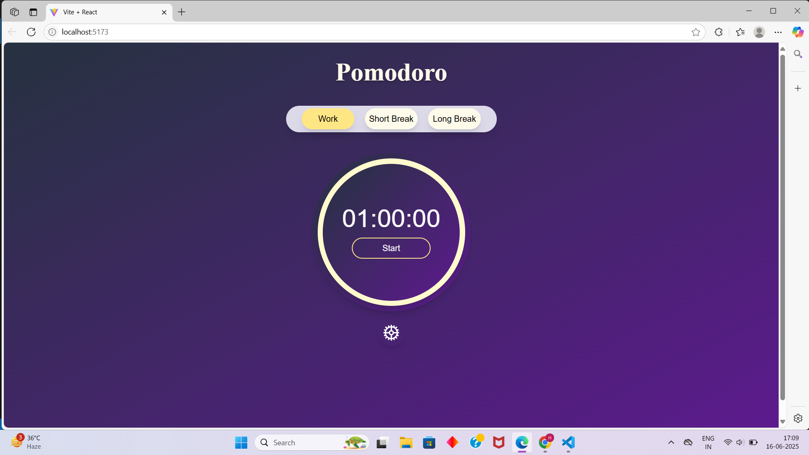
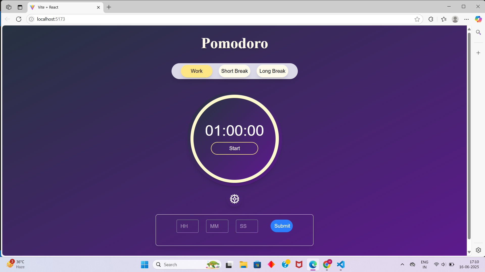
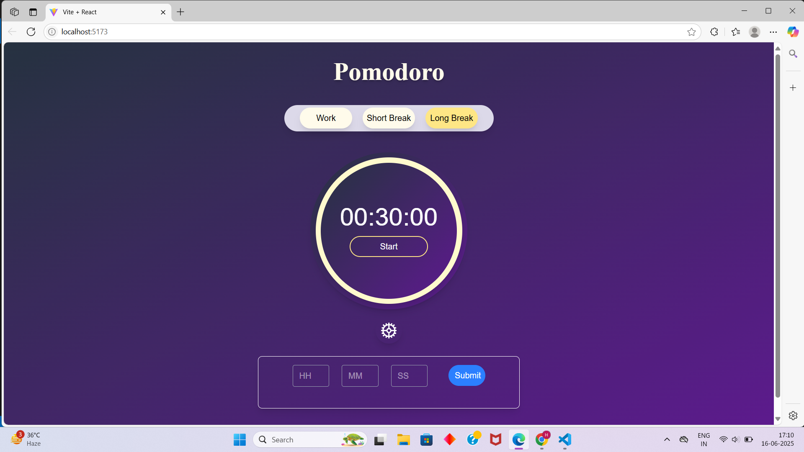

# Pomodoro Timer ⏱️

A modern, responsive Pomodoro timer app built with **React** and **Tailwind CSS**.  
Boost your productivity using the Pomodoro technique — work with focus, rest with purpose!

## 🚀 Features

- Clean UI with circular timer
- Adjustable work/break intervals
- Context API for global state management
- Responsive layout
- Built with React + Vite + Tailwind CSS

## 📸 Screenshots






## 🛠️ Setup Instructions

```bash
git clone https://github.com/shobhit-m2004/PomodoroApp.git
cd PomodoroApp/pomodoro
npm install
npm run dev
